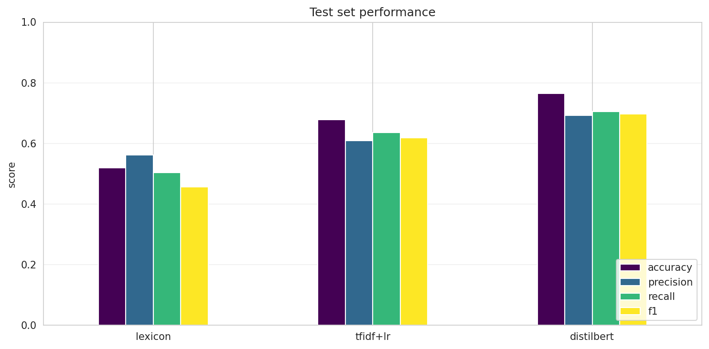
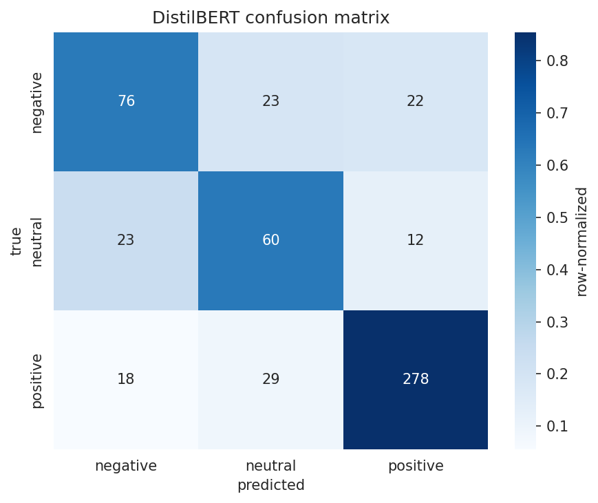

# Aspect-Based Sentiment Analysis on Restaurant Reviews

Fine-tuning DistilBERT for aspect-level sentiment classification on the SemEval-2014 Task 4 dataset. Compares against rule-based and TF-IDF baselines.

UTS Natural Language Processing — Assignment 3.

## Task

Given a customer review and a target aspect term mentioned in it, predict the sentiment expressed toward that specific aspect. For example:

> "The pasta was amazing but service was slow."

| Aspect | Predicted sentiment |
|---|---|
| pasta | positive |
| service | negative |

This is more informative than document-level sentiment analysis, which would output a single confused label for such mixed reviews.

## Dataset

SemEval-2014 Task 4 — Restaurant reviews (Pontiki et al., 2014), accessed via the HuggingFace mirror [`tomaarsen/setfit-absa-semeval-restaurants`](https://huggingface.co/datasets/tomaarsen/setfit-absa-semeval-restaurants).

After dropping the rare `conflict` class, we work with **3,602 (text, aspect, sentiment)** triples across three classes: positive, negative, neutral. Stratified 70/15/15 split into train / validation / test (2,522 / 539 / 541).

## Models

| Model | Approach |
|---|---|
| Lexicon | Hand-crafted positive/negative word lists; majority vote per review. |
| TF-IDF + LR | Aspect prepended to text; bigram TF-IDF features; balanced logistic regression. |
| **DistilBERT (ours)** | `distilbert-base-uncased` fine-tuned with `[CLS] aspect [SEP] review [SEP]` input format, weighted cross-entropy, early stopping on validation macro-F1. |

## Results (test set, n=541)

| Model | Accuracy | Precision | Recall | F1 (macro) |
|---|---|---|---|---|
| Lexicon | 0.5194 | 0.5620 | 0.5045 | 0.4562 |
| TF-IDF + LR | 0.6784 | 0.6095 | 0.6355 | 0.6191 |
| **DistilBERT** | **0.7652** | **0.6921** | **0.7050** | **0.6971** |

DistilBERT improves macro-F1 by **+7.80 percentage points** over the strongest baseline.

### Per-class F1 (DistilBERT)

| Class | F1 |
|---|---|
| Negative | 0.639 |
| Neutral | 0.580 |
| Positive | 0.873 |





## Reproducing the results

```bash
# Recommended environment: free Google Colab with T4 GPU
pip install transformers datasets torch scikit-learn pandas numpy matplotlib seaborn
```

Open `absa_distilbert_Ass3.ipynb` in Colab and run all cells. Total runtime is ~5 minutes including DistilBERT training. Random seed is fixed at 42; minor (~1%) variation across runs is expected due to GPU non-determinism.

## Repository contents

| File | Description |
|---|---|
| `absa_distilbert_Ass3.ipynb` | End-to-end Colab notebook |
| `results.json`, `results.csv` | Final metrics for all three models |
| `errors.csv` | DistilBERT misclassifications for error analysis |
| `eda.png` | Sentiment distribution and review length histogram |
| `comparison.png` | Headline test-set performance chart |
| `confusion.png` | DistilBERT confusion matrix |
| `per_class_f1.png` | Per-class F1 across all three models |

## References

- Devlin et al. (2019). *BERT: Pre-training of Deep Bidirectional Transformers for Language Understanding.* NAACL.
- Pontiki et al. (2014). *SemEval-2014 Task 4: Aspect Based Sentiment Analysis.* SemEval.
- Sanh et al. (2019). *DistilBERT, a distilled version of BERT.* arXiv:1910.01108.
- Sun et al. (2019). *Utilizing BERT for Aspect-Based Sentiment Analysis via Constructing Auxiliary Sentence.* NAACL.
